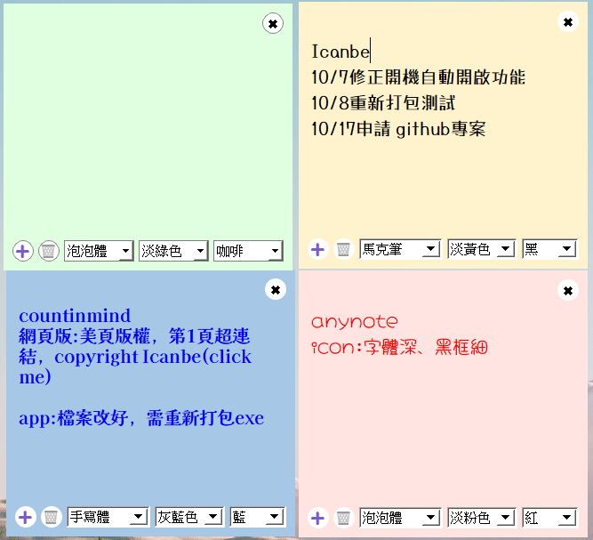
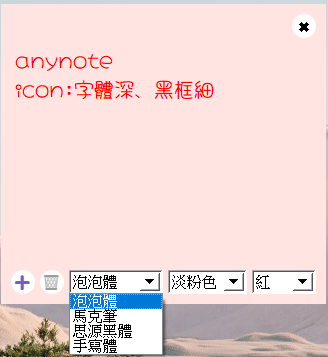

##  Official Page  --> [Visit AnyNote Official Page](https://farloveway.github.io/AnyNote/)

# AnyNote — Sticky Notes Desktop App

**AnyNote** is a simple and lightweight sticky notes desktop app built with **Python + PyQt5**.  
It allows users to create, edit, and save multiple colorful notes on their screen,  
with customizable fonts, colors, and automatic saving.

- A lightweight PyQt5 sticky note app can download for Windows.

---

##  Download

the latest version:
- --> [AnyNote_v1.0.0.zip](https://github.com/farloveway/AnyNote/releases/download/v1.0.0/AnyNote_v1.0.0.zip) （suggestion）

> If Windows shows a “Security Warning”, click More info → Run anyway.
> This message appears because the app is unsigned — it is safe to run.
>
> This app provides for personal with safe coding.

---

##  Features
-  * Multiple sticky notes that can be freely dragged around  
-  * Auto-save notes; content is automatically reloaded when reopened  
-  * Supports 4 custom fonts and multiple colorful note styles  
-  * Switchable text colors  
-  * Stores multiple notes in JSON format

---

##  Software Screenshots
| Main Window | Color Options | Font Settings |
|:--:|:--:|:--:|
|  |  |  |

---

##  System Requirements
- Windows 10 / 11
- No Python installation required (already packaged as .exe)

---

##  Usage
1. Download, unzip, and run AnyNote.exe
2. Click on any sticky note to edit text
3. Use the bottom menu to switch fonts, text colors, and background themes, or to add ➕ / delete 🗑️ notes
4. Notes are auto-saved while editing and automatically reloaded next time
5. The 🅧 button at the top right hides the note window
6. The system tray icon (bottom-right corner) provides right-click options: Show Notes, Hide Notes, and Exit App

---

##  Developed Information
- Language:Python 3.10 + PyQt5  
- Packaging Tool:PyInstaller  
- Developer:farloveway  
- Project Status: v1.0.0 (Initial Release)

---

##  Copyright Rules
This software is provided for personal and educational use only.
Commercial distribution is not allowed.
Please obtain permission from the author before modifying or redistributing the program.
> © 2025 AnyNote. Developed by farloveway.  
> All rights reserved.

---

# AnyNote — 便利貼桌面應用程式

**AnyNote** 是一款極簡且輕量化的便利貼應用程式
，以 Python + PyQt5 開發，可支援多個便利貼、字體切換、顏色樣板與自動儲存功能。  

目前提供 Windows 桌面版下載。

---

## 🚀 下載 Download

最新版下載：
- 👉 [AnyNote_v1.0.0.zip](https://github.com/farloveway/AnyNote/releases/download/v1.0.0/AnyNote_v1.0.0.zip) （建議）

 
> 若執行時出現「Windows 安全警告」，請選擇「更多資訊 → 仍要執行」。
> 此為 Windows 系統的安全提示，因本程式未簽章所致，請安心執行。
  
> 本程式僅供個人使用，無惡意程式碼。

---

## ✨ 功能特色 Features
- 🗒️ 多便利貼視窗，可自由拖曳位置  
- 💾 自動儲存內容，重開程式自動載入  
- 🎨 支援 4 種字體與多色便利貼樣式  
- 🔤 字體顏色可切換  
- 📌 支援 JSON 格式儲存多筆筆記  

---

## 📷 軟體截圖 Software Screenshots
| 主畫面 | 顏色選擇 | 字體設定 |
|:--:|:--:|:--:|
|  |  |  |

---

## 🧩 系統需求 System Requirements
- Windows 10 / 11
- 不需安裝 Python（已打包成 exe）

---

## 📘 使用說明 Usage
1. 下載(解壓)並執行 `AnyNote.exe`  
2. 點擊便利貼即可編輯文字  
3. 使用下方選單可切換字體、顏色與背景顏色，以及新增➕、刪除🗑️便利貼  
4. 編輯時會自動儲存筆記內容，下次開啟會自動載入
5. 便利貼視窗右上角 🅧 ，為隱藏便利貼按鍵
6. 電腦螢幕右下角，為系統匣縮小圖示，使用右鍵可顯示功能: 顯示便利貼\隱藏便利貼\關閉程式

---

## 🧑‍💻 開發資訊 Developed Information
- 開發語言：Python 3.10 + PyQt5  
- 封裝工具：PyInstaller  
- 開發者：farloveway  
- 專案狀態：v1.0.0（初始版）

---

## 📜 授權條款 Copyright Rules
本程式僅供個人使用與學習之用，禁止商業散布。  
如需修改或轉發，請先取得作者同意。
> © 2025 AnyNote. Developed by farloveway.  
> All rights reserved.
